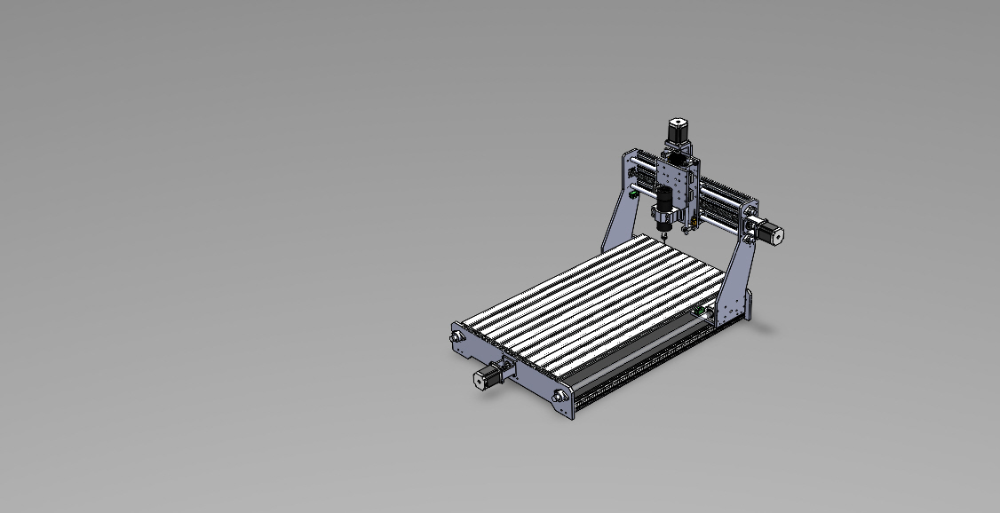

# CNC Router

Custom DIY CNC router based on ESP32 + FluidNC, designed for PCB prototyping, wood machining, acrylic fabrication and soft metal machining.

---

## Project Overview

This project documents the design and construction of a custom CNC router developed as an engineering and learning platform focused on:

- CNC machine development
- Embedded systems integration
- Mechanical design
- Electronics and motion control
- FluidNC firmware configuration
- CAD/CAM workflow
- Real-world troubleshooting and calibration

The machine is being developed with a strong focus on modularity, experimentation and practical engineering solutions.

---

## Project Goals

- Build a functional low-cost CNC platform
- Learn CNC machine engineering
- Experiment with ESP32 + FluidNC
- Prototype PCBs and small mechanical parts
- Improve electronics and firmware integration skills
- Document the complete development process

---

## Specifications

| Parameter | Value |
|---|---|
| Work Area | 220 x 430 x 120 mm |
| Controller | ESP32 6x_CNC_Controller + FluidNC + WebUI |
| Firmware | FluidNC |
| Motion System | Lead Screw |
| Machine Type | DIY CNC Router |
| Homing System | Enabled |
| Emergency Stop | Enabled |
| Probe Input | Enabled |

---

## Current Status

- [x] Mechanical structure
- [x] X/Y/Z movement
- [x] FluidNC configuration
- [x] Homing system
- [x] Emergency stop
- [x] Probe input
- [ ] Tool setter
- [x] Cable management
- [ ] Dust collection system
- [ ] Final enclosure

---

## Mechanical Design

The machine structure combines custom-designed components with commercially available mechanical parts.

Some reference CAD models such as motors, lead screws and standard mechanical components were obtained from public engineering libraries like GrabCAD to accelerate assembly and integration workflows.

---

## Electronics

Main electronics currently used in the project:

* ESP32-based "6x_CNC_Controller"
* FluidNC firmware
* Bart Dring WebUI interface
* Stepper motor drivers
* External power supply system
* Emergency stop (E-Stop) circuit
* Probe input system
* Homing/limit switches
* Motion control wiring
* Shielded signal and motor wiring
* Cooling system for drivers and electronics
* Spindle control interface
* USB and WiFi connectivity
* GPIO-based machine control inputs
* Custom machine wiring and cable routing

The electronics architecture focuses on modularity, reliability and ease of maintenance while keeping the system flexible for future upgrades and experimentation.

---
